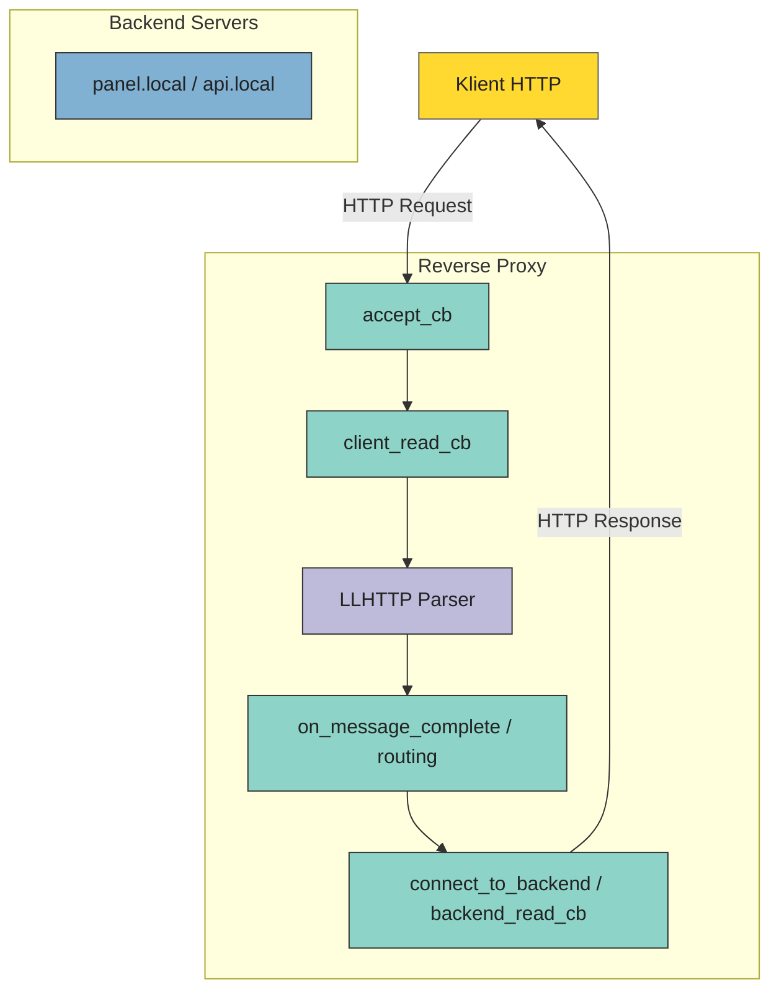

# Zenovia Reverse Proxy – Dokumentacja

### 0. Opis

Zenovia Reverse-Proxy HTTP, to program który odbiera żądania od klienta i przekazuje je do odpowiedniego backendu na podstawie nagłówka 'Host'. Reverse-proxy działa jako pośrednik między klientem a backendem, buforując dane i obsługując odpowiedzi, w tym błędy (502).

- Program działa na linuxie
- Jest w fazie rozwoju

### PLANY ROZWOJU PROJEKTU
- keep-alive,
- low-watermark,
- timeouts,
- dodać .h
- obsługa typowych kodów http
- logger zamiast printf
- ewentualnie rozdzielenie na mniejsze pliki
- wolfssl/openssl

## 1. Przepływ danych

- **Klient HTTP** → wysyła żądania do proxy.  
- **Reverse Proxy**:
  - `accept_cb` – przyjmuje połączenia.  
  - `client_read_cb` – odbiera dane od klienta.  
  - **LLHTTP Parser** – analizuje requesty.  
  - `on_message_complete / routing` – decyduje, który backend.  
  - `connect_to_backend / backend_read_cb` – wysyła dane do backendu i odbiera odpowiedź.  
- **Backend** – serwer HTTP (np. Python `http.server`) odbiera request i zwraca odpowiedź.  
- Dane od backendu trafiają do bufferevent klienta i wracają do klienta.  

## 2. Architektura programu

- **accept_cb**  
  - Wywoływana przy każdym nowym połączeniu od klienta.  
  - Tworzy strukturę połączenia (`struct conn`) i inicjalizuje bufferevent dla klienta.  
  - Rozpoczyna nasłuchiwanie na dane od klienta.

- **client_read_cb**  
  - Odbiera dane HTTP z klienta z bufferevent.  
  - Przekazuje je do **LLHTTP Parser** do analizy nagłówków i requesta.  
  - Skleja dane w buforze `pending`, który będzie wysłany do backendu po wybraniu odpowiedniego hosta.

- **LLHTTP Parser**  
  - Analizuje request HTTP klienta.  
  - Wywołuje callbacki:
    - `on_header_field` – wykrywa pola nagłówków, w tym `Host`.
    - `on_header_value` – odczytuje wartość nagłówka `Host`.
    - `on_message_complete` – po pełnym sparsowaniu requesta przekazuje sterowanie do routingu backendu.

- **on_message_complete / routing**  
  - Sprawdza, czy `Host` klienta odpowiada jednemu z backendów zdefiniowanych w tablicy `backends`.  
  - Jeśli backend istnieje → wywołuje `connect_to_backend`.  
  - Jeśli backend nie istnieje → wysyła **HTTP 502 Bad Gateway** do klienta i ustawia flagę `close_after_write`.

- **connect_to_backend / backend_read_cb**  
  - Tworzy bufferevent do połączenia z backendem.  
  - Po nawiązaniu połączenia przesyła zgromadzone dane z `pending`.  
  - Odbiera odpowiedź z backendu i przesyła ją z powrotem do klienta (zero-copy).

### Dodatkowe funkcjonalności

- Obsługa **niepoprawnych requestów HTTP** – w `client_read_cb` parser może wykryć błędy i zamknąć połączenie.  
- Buforowanie danych **pending** – dane od klienta są tymczasowo przechowywane, zanim backend będzie gotowy.  
- Zamykanie połączeń po wysłaniu odpowiedzi (`close_after_write` i `conn_free`).  
- Obsługa wielu backendów, routing na podstawie nagłówka `Host`.  

---

## 3. Jak uruchamiać i testować

### Uruchomienie proxy

```bash
./program
```

* Proxy nasłuchuje na porcie **8081**.

### Uruchomienie backendów

```bash
# Backend 1 – panel.local
python -m http.server 9090

# Backend 2 – api.local
python -m http.server 9091
```

### Testowanie żądań z klienta

```bash
# Request do panel.local
curl -v -H "Host: panel.local" http://127.0.0.1:8081/somepath

# Request do api.local
curl -v -H "Host: api.local" http://127.0.0.1:8081/somepath

# Request do nieistniejącego backendu -> zwróci 502
curl -v -H "Host: unknown.local" http://127.0.0.1:8081/somepath
```


---

## 4. Jak skompilować kod

```bash
# Instalacja potrzebnych zależności
sudo apt update && sudo apt install -y build-essential libevent-dev
```
### Przygotuj bibliotekę llhttp

```bash
git clone https://github.com/nodejs/llhttp.git /tmp/llhttp 
cd /tmp/llhttp

npm install 
make

# Instalacja ręczna (statyczna biblioteka + header) 
sudo cp build/libllhttp.a /usr/local/lib/ 
sudo cp include/llhttp.h /usr/local/include/ 
sudo ldconfig

# Usunięcie katalogu źródłowego
cd / && rm -rf /tmp/llhttp
```

```bash
# Kompilacja
gcc -Wall -O2 -o out/program src/program.c -levent -lllhttp
```

## Diagram programu



## 5. Wnioski / Zdobyte umiejętności

Projekt Zenovia Reverse Proxy pozwolił mi na praktyczne doświadczenie w:

- Obsłudze wielu równoczesnych połączeń HTTP w czasie rzeczywistym.
- Buforowaniu i przesyłaniu strumieni danych między klientem a backendem.
- Asynchronicznym programowaniu w C z użyciem libevent.
- Analizie ruchu sieciowego i reagowaniu na błędy HTTP (502, niepoprawne requesty).
- Planowaniu rozwoju projektu w kierunku produkcyjnym: keep-alive, logger, modularność, TLS.

Projekt stanowi solidną podstawę do dalszej pracy z przetwarzaniem strumieni danych i cyfrowych sygnałów.
